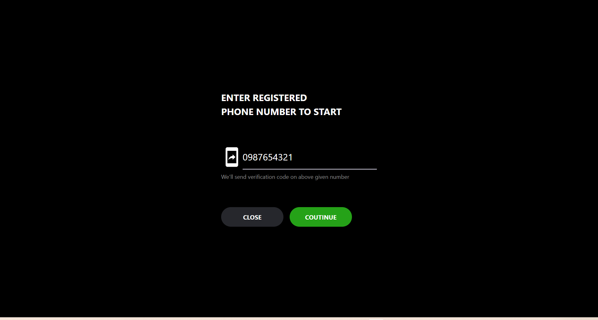
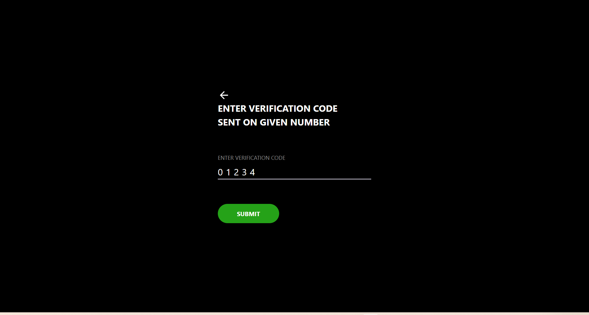
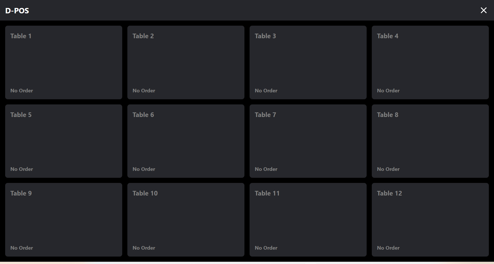
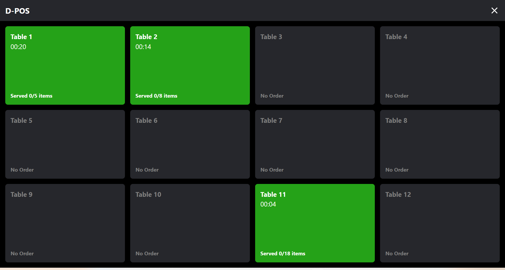
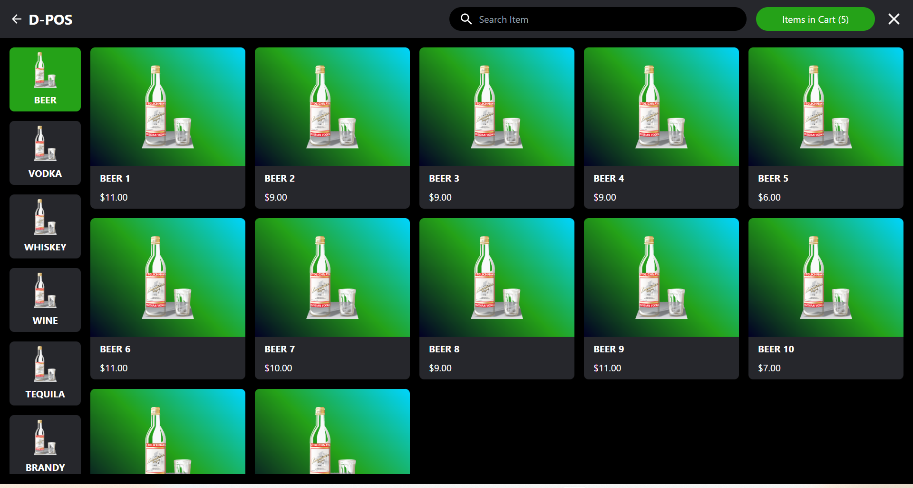
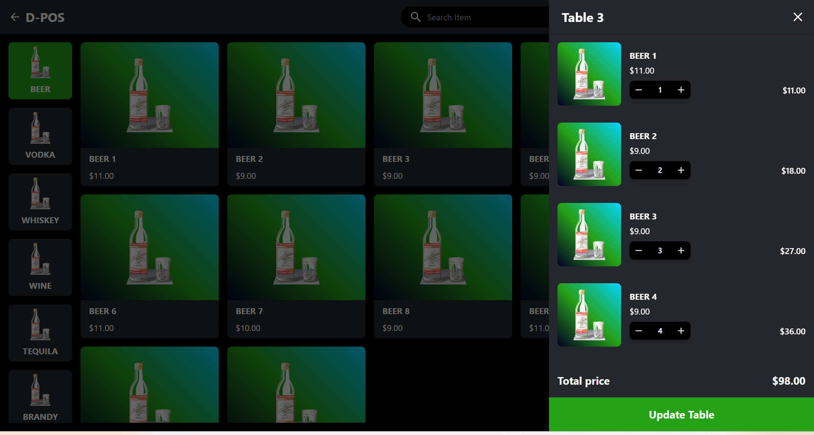
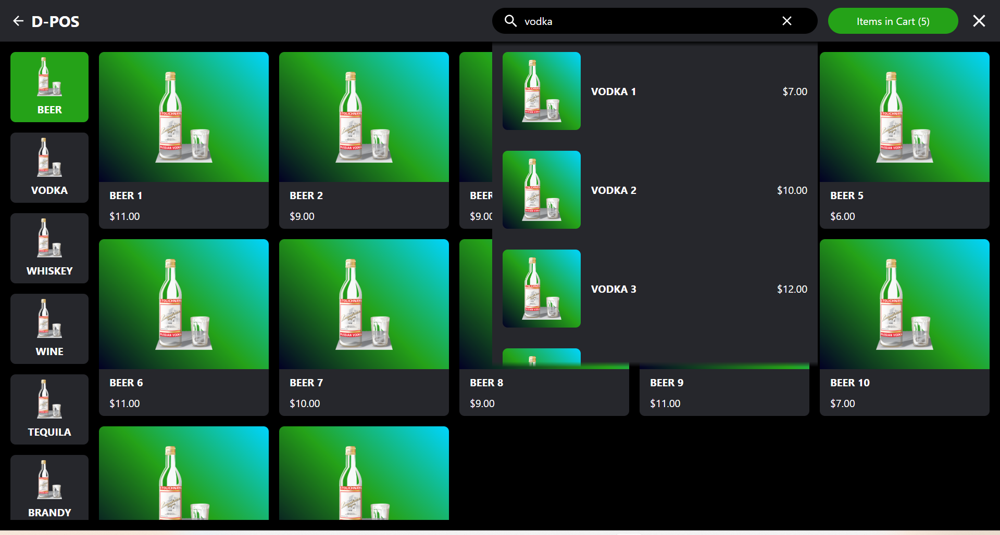
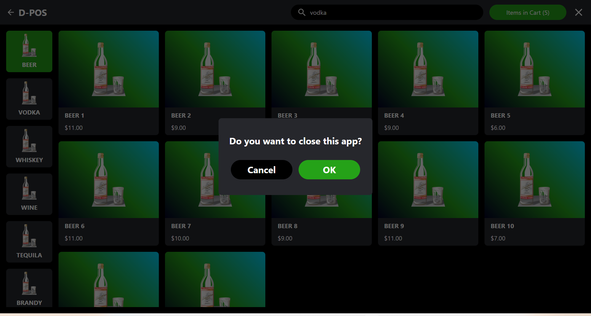

# D-POS

This is a prototype D-POS template using Electron

## Technology Stack and Features

- [React](https://react.dev/) for the frontend component.
  - Using TypeScript, hooks, and other parts of a modern frontend stack.
- [Electron](https://www.electronjs.org/) for the build cross-platform desktop apps.

## Review

## How to use it

You can just **fork or clone** this repository and use it as is.

## License

The D-POS template is licensed under the terms of the [MIT license](/LICENSE).
